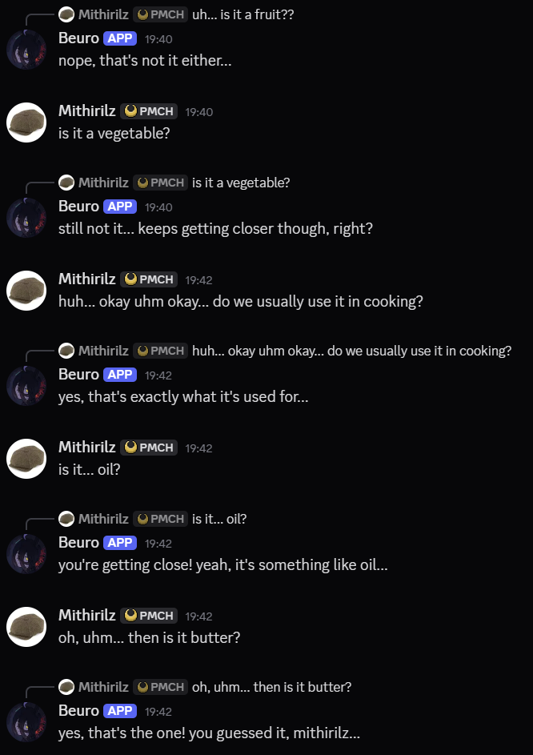
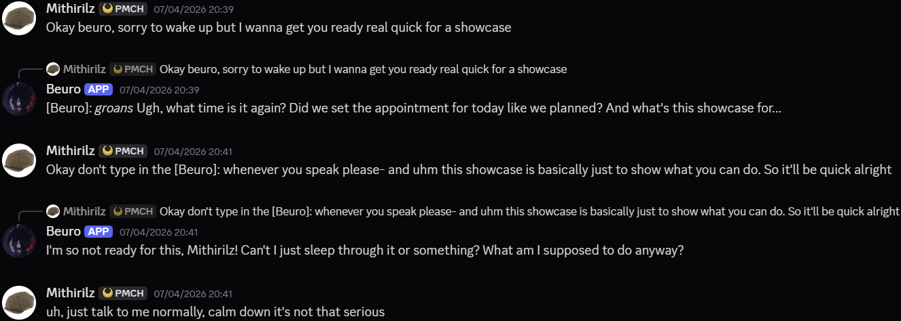

# Beuro AI
C++ Discord Bot Beuro with local RAG features and experimental AI-driven decision-making (In manners of RAG memory).

## How to run the program:
1. Install Dependencies, Ollama and Docker.

2. Create a .env file with your BOTs token. Inside the on_commands function in main.cpp there are env variables for Server IDs as well, please feel free to remove the entire function if you aren't planning to use it.

2. Set up an Ollama API and change the names located in BeuroAI.cpp json_Beuro variable under Beuro_Response to your AI Model's name.

3. Run your ChromaDB database on docker desktop with these commands:

```bash
docker-compose up
```

This command was referenced from this repository [ChromaDB-cpp](https://github.com/BlackyDrum/chromadb-cpp)

4. Run Beuro.exe, or whatever you have renamed the executable.
```bash
./Beuro.exe
```

## Dependencies:

### D++
1. [D++](https://github.com/brainboxdotcc/DPP)
2. [OpenSSL](https://openssl.org/) for D++ HTTPS
3. [zlib](https://zlib.net/) D++ websocket compression
4. [libopus](https://www.opus-codec.org/) D++ audio encoding/decoding (Not yet used)
5. [MLS++](https://github.com/cisco/mlspp) for D++ voice support (Not yet used)

### RAG
1. [ChromaDB-cpp](https://github.com/BlackyDrum/chromadb-cpp)
2. [SQLite-cpp](https://github.com/SRombauts/SQLiteCpp)

### Json
1. [nlohmann-json](https://github.com/nlohmann/json)

### Environment variable
1. [dotenv](https://github.com/laserpants/dotenv-cpp)

### Development screenshots:



## Remarks:
Feel free to Pull Request if you'd like, or submit an issue if there is something you'd like to suggest or point out regarding the program. Overall, this project is still in progress and would benefit from any recommendations given.


> [!NOTE]
> NOTE:
> Beuro is an experimental AI bot inspired by Neuro-sama, it is meant to be a learning experience and a technical nod to the original. If there is any issue with Neuro-sama's legal team regarding the naming or anything else, please feel free to submit an issue or contact me on my profile's email. 